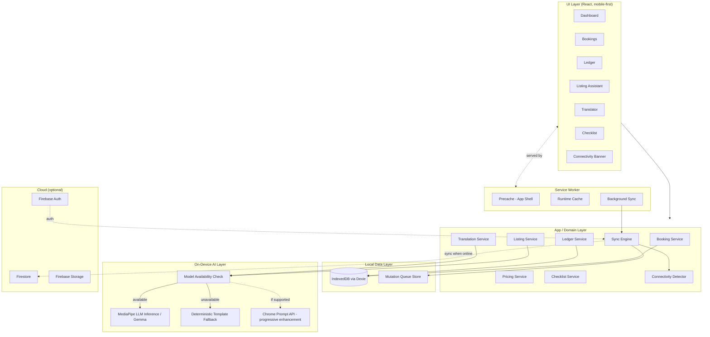

# 02 — PWA Architecture

## Overview
Homestay Saathi is a single-page Next.js (App Router, static export where possible) TypeScript PWA. All core functionality runs client-side against IndexedDB; Firebase is an optional, non-blocking sync target.

## Layered Architecture

## Frontend
- Next.js + TypeScript, mobile-first responsive layout, large tap targets, high-contrast theme for sunlight readability (see `06-offline-ux-wireframes.md`).
- No SSR dependency for core flows — the app must be fully functional as a static, cached bundle.
- State management: React Query-style local cache backed directly by Dexie live queries (`useLiveQuery`), avoiding a separate global store that could drift from IndexedDB truth.

## Service Worker
- Workbox-generated, precaches the app shell, fonts, icons, and (where feasible) model assets.
- Runtime caching strategies defined per-resource-type in `03-service-worker-caching.md`.
- Registers Background Sync for the mutation queue.

## IndexedDB
- Dexie.js wrapping IndexedDB; schema in `08-data-model.md`.
- Source of truth for all app data. UI always reads from IndexedDB, never from an in-memory-only cache that could diverge from persisted state.

## Sync Engine
- Queue-based, append-only mutation log (`04-data-sync-protocol.md`).
- Triggered by: connectivity regained event, Background Sync event, manual "Sync now" action.
- Never blocks UI — all writes complete locally first, sync is a background concern.

## Firebase (optional layer)
- Firebase Auth: lightweight phone/email auth, only required to enable cloud sync — not required to use the app.
- Firestore: mirror of booking/ledger/listing entities, keyed by `entityId`.
- Firebase Storage: only if listing photos are added (P2).
- App must detect Firebase unreachable/unconfigured and continue operating with sync status `offline` — never throw a blocking error.

## AI Layer
- Model availability is checked once at startup and cached for the session; UI reflects `checking | available | unavailable`.
- See `09-ai-architecture.md` for model selection, loading, and prompt design.

## Web Share
- Used only for pushing a finished listing to external channels (WhatsApp, Facebook) once connectivity/Share target exists.
- Never a dependency for core in-app flows.

## Connectivity Detection
- Combines `navigator.onLine` with a lightweight periodic reachability ping (small HEAD request to Firebase or a known endpoint), since `navigator.onLine` alone is unreliable on captive/degraded networks.
- Debounced state transitions to avoid banner flicker on flaky signal.

## Data Flow Summary
1. User action → domain service → write to IndexedDB (source of truth) → UI updates via live query.
2. Same action, if it represents a syncable mutation → also appended to mutation queue.
3. Sync Engine drains the queue opportunistically when online, updates `syncStatus` per record.
4. AI requests go through the availability-checked AI layer; results are written back into IndexedDB like any other content, never held only in memory.

## Assumptions Requiring Validation
- Availability of MediaPipe LLM Inference WebAssembly build performance on target low-end devices (see `09-ai-architecture.md`).
- Background Sync API support varies by Android Chrome version — must confirm minimum tested device in README.
- IndexedDB storage quota behavior on low-end devices under storage pressure.
