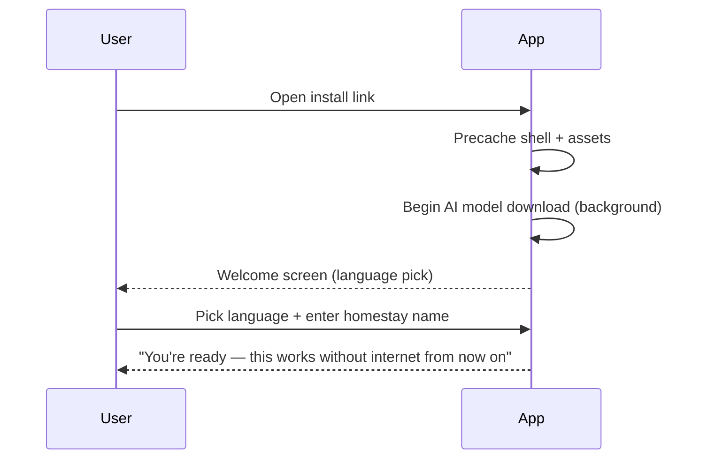

# 06 — Offline UX Wireframes & Specification

## Design Principles for This Context
- **Sunlight-legible:** high contrast, minimum 16px body text, avoid thin/light font weights.
- **Big touch targets:** minimum 48x48dp, generous spacing — cheap touchscreens are less precise.
- **Low literacy/technical familiarity:** icons paired with text labels, minimal jargon ("Offline" not "Network unreachable"), no nested settings menus for core actions.
- **Multilingual:** UI chrome available in Nepali/Bengali/Hindi/English; language switch is one tap from every screen, not buried in settings.
- **Connectivity state is always visible**, never something the user has to check for.

## Global: Connectivity Banner

```
┌─────────────────────────────────────┐
│ 🟢 Online · Synced 2 min ago         │   (green, dismissible after 3s)
├─────────────────────────────────────┤
│ 🟠 Offline · 3 changes waiting        │   (persistent, always visible)
├─────────────────────────────────────┤
│ 🔵 Syncing… (2 of 3)                  │   (progress, auto-dismisses)
├─────────────────────────────────────┤
│ 🔴 Sync issue · Tap to review         │   (persistent until resolved)
└─────────────────────────────────────┘
```
Banner sits pinned below the header on every screen — never a toast that disappears before being read.

## First Launch (online)



## Offline Dashboard

```
┌─────────────────────────────────────┐
│ 🟠 Offline · 2 changes waiting        │
│ Namaste, Sunita's Homestay           │
├─────────────────────────────────────┤
│ Today                                │
│  • Ramesh K. — checking in           │
│  • ₹1,800 pending payment            │
├─────────────────────────────────────┤
│ [➕ New Booking] [💬 Translate]        │
│ [📒 Ledger]      [✅ Checklist]        │
│ [🏠 My Listing]                       │
└─────────────────────────────────────┘
```
All 5 actions are single-tap from dashboard root — no drill-down needed for the most frequent tasks.

## Booking Creation (offline)

```
┌─────────────────────────────────────┐
│ New Booking                    [✕]   │
│ Guest name        [___________]      │
│ Phone (optional)  [___________]      │
│ Check-in   [📅]   Check-out  [📅]     │
│ Guests     [ – 2 + ]                 │
│ Amount     [₹ _____]                 │
│ Notes      [___________]             │
│                                       │
│         [ Save Booking ]             │
│  Saved on this phone · will sync     │
│  when you're online                  │
└─────────────────────────────────────┘
```
Confirmation copy after save explicitly reassures: "Saved on this phone."

## Cash Ledger

```
┌─────────────────────────────────────┐
│ Ledger                    This Month │
│ Income   ₹18,400                     │
│ Expense  ₹3,200                      │
│ Balance  ₹15,200                     │
├─────────────────────────────────────┤
│ + Booking · Ramesh K.    ₹1,800  ⏳   │
│ – Expense · Groceries    ₹450    ✅   │
├─────────────────────────────────────┤
│ [➕ Add Expense]                      │
└─────────────────────────────────────┘
```
⏳ = pending payment, ✅ = settled, independent of sync status (a payment can be settled while still offline).

## AI Listing Generator

**Model available:**
```
┌─────────────────────────────────────┐
│ Listing Assistant     🤖 On-device   │
│ [Form: rooms, amenities, food, ...]  │
│         [ Generate Listing ]         │
├─────────────────────────────────────┤
│ Headline: "Cozy tea-garden stay..."  │
│ Short / Detailed / Amenities tabs    │
│         [ Save ]  [ Edit ]           │
└─────────────────────────────────────┘
```

**Model unavailable:**
```
┌─────────────────────────────────────┐
│ Listing Assistant    ⚠️ AI offline   │
│ We'll use a simple template instead  │
│ of AI-written text for now.          │
│ [Form: rooms, amenities, food, ...]  │
│      [ Build Listing from Template ] │
└─────────────────────────────────────┘
```

## Translation

```
┌─────────────────────────────────────┐
│ Translate Guest Message   🤖 Ready   │
│ [ Paste or type guest's message ]    │
│ Detected: English                    │
│ → Nepali: [translated text]          │
├─────────────────────────────────────┤
│ Suggested reply (pick a scenario):   │
│ [Pricing] [Directions] [Check-in]... │
│ "स्वागत छ! हाम्रो मूल्य..."             │
│         [ Copy Reply ]               │
└─────────────────────────────────────┘
```

## Sync Queue / Success / Failure

```
Sync Queue (offline)          Sync Success            Sync Failure
┌─────────────────────┐      ┌─────────────────┐      ┌─────────────────────┐
│ 3 changes waiting    │      │ 🟢 All synced    │      │ 🔴 1 item didn't sync │
│ • Booking: Ramesh    │  →   │ Last: just now   │      │ Booking: Ramesh       │
│ • Expense: Groceries │      └─────────────────┘      │ [ Retry ] [ Details ] │
│ • Checklist: 3 items │                                └─────────────────────┘
└─────────────────────┘
```

## Conflict Screen

```
┌─────────────────────────────────────┐
│ Booking updated on two phones        │
│ Kept: Amount ₹1,800 (newer, from     │
│ this phone, 2:14 PM)                 │
│ Older value from other phone: ₹1,600 │
│         [ Keep This ] [ Undo ]       │
└─────────────────────────────────────┘
```

## Service-Worker Offline Fallback (edge case)
If a route somehow isn't precached (bad deploy), the fallback screen still shows the full app shell/nav, with a small inline note: "This page couldn't load — try Dashboard" rather than a generic browser "No internet" page.

## Model Unavailable State (global)
Any AI-dependent screen shows a consistent `⚠️ AI offline` badge in the header and swaps generative actions for deterministic template equivalents — never a spinner that never resolves.

## Assumptions Requiring Validation
- Real device testing for actual font legibility/contrast in direct sunlight (target: WCAG AA minimum, aim for AAA on primary text).
- Icon comprehension testing with non-English-literate users for the 5 dashboard actions.
