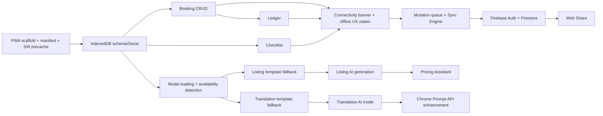

# 13 — Solo-Developer Implementation Plan

## Priority Legend
- **P0** — absolutely required for a valid, judgeable submission
- **P1** — important, meaningfully improves score, cut only under real time pressure
- **P2** — stretch, only after P0+P1 are demo-solid

## Feature Priorities

| Feature | Priority |
|---|---|
| App shell, routing, offline-first PWA scaffold (manifest, SW precache) | P0 |
| IndexedDB schema + Dexie setup | P0 |
| Booking CRUD | P0 |
| Cash ledger (derived + manual expenses) | P0 |
| Hosting checklist | P0 |
| Connectivity banner + offline UX states | P0 |
| On-device AI: model loading + availability detection | P0 |
| Listing Assistant with deterministic template fallback | P0 |
| Listing Assistant AI generation (on-device model) | P0 (fallback ships first as safety net) |
| Translation (4 languages, 8 scenarios, template fallback) | P0 |
| Translation AI-based free-text mode | P1 |
| Pricing Assistant (rule-based) | P1 |
| Sync Engine + mutation queue | P1 |
| Firebase Auth + Firestore sync | P1 |
| Web Share for listings | P2 |
| Chrome Prompt API progressive enhancement | P2 |
| App-level PIN lock | P2 |
| Multi-homestay / profile switching | P2 (explicitly out of scope for hackathon) |

## Implementation Order & Dependencies

Rationale for ordering: every AI feature ships with its deterministic fallback *first*, so the app is demo-safe even if on-device AI integration runs into last-mile device-compatibility issues — this directly protects the "Works offline" and "Craft" judging criteria from an AI integration risk.

## Estimated Effort (solo developer, hackathon timeframe)

| Phase | Effort (rough) |
|---|---|
| Scaffold + SW + manifest | 0.5 day |
| Data layer (Dexie schema, domain services) | 0.5 day |
| Booking + Ledger + Checklist UI | 1 day |
| Connectivity/offline UX states | 0.5 day |
| AI model integration + availability detection | 1 day |
| Listing Assistant (template + AI) | 1 day |
| Translation (template + AI) | 1 day |
| Sync Engine + mutation queue | 1 day |
| Firebase Auth + Firestore | 0.5 day |
| Pricing Assistant | 0.25 day |
| Testing pass (`11-testing-strategy.md`) | 0.75 day |
| Demo recording + README | 0.5 day |
| **Total** | **~8.5 days** |

Compress by cutting P1/P2 items first (sync/Firebase, AI free-text translation, pricing) — the P0 list alone is a fully judgeable, offline-complete submission even without cloud sync.

## Technical Risks & Fallback Implementations

| Risk | Fallback |
|---|---|
| MediaPipe LLM Inference model too slow/large on minimum device | Drop to a smaller quantized model tier, or ship template-only for listing/translation and document the limitation honestly in README rather than overclaiming |
| Background Sync API unsupported on test device | App-level retry-on-foreground/visibilitychange loop with the same exponential backoff logic, documented as the fallback path |
| Firebase unreachable during demo | Sync Engine already designed to degrade silently to "offline" without blocking — no special-casing needed, just confirm during rehearsal |
| Chrome Translator/Prompt API absent | Already treated as pure progressive enhancement — no risk to core scope |
| Time runs out before Sync Engine is solid | Ship P0 offline-only feature set; explicitly note in README that sync is a documented, designed-but-partially-implemented layer — honest scoping beats a broken demo |

## Demo Preparation
- Follow `12-hackathon-demo.md` script exactly; rehearse at least twice on the actual demo device before final recording.
- Reset app state to a clean demo dataset before recording.
- Confirm AI model is pre-downloaded before recording to stay within the 2-minute budget.

## Final Submission Checklist
- [ ] Public URL live and installable
- [ ] PWA installs and works fully after one online load (verified airplane-mode pass)
- [ ] Public repository with clean commit history
- [ ] README documents: on-device model(s) used, minimum tested device, exact model-unavailable behavior
- [ ] 2-minute demo video recorded with airplane mode visibly enabled on camera
- [ ] All 13 architecture documents included in repo for judge reference
- [ ] Known limitations (sync partial support, single-device profile, etc.) stated plainly in README — never implied as complete if not

---

## Architecture Decision Record — Summary

| Decision | Choice | Why |
|---|---|---|
| Framework | Next.js + TypeScript | Familiar, strong PWA tooling, static-export friendly |
| Local storage | IndexedDB via Dexie | Mature abstraction, live queries simplify offline-first UI |
| Caching | Workbox, cache-first for shell/static, no network-first anywhere in core flow | Guarantees offline usability by construction, not by luck |
| Sync model | Append-only mutation queue, idempotent via `operationId`, LWW + field-merge conflicts | Robust against real multi-device, intermittent-connectivity conditions |
| AI | On-device MediaPipe/Gemma, Chrome Prompt API as pure enhancement, deterministic template fallback everywhere | Satisfies "on-device AI done well" without ever risking a broken/hung feature when the model can't load |
| Cloud | Firebase, fully optional | App must be complete and honest without it; sync is additive, not foundational |
| Pricing | Rule-based, not AI | Avoids hallucinated "live market data" while offline, per explicit brief instruction |

## MVP Feature Freeze
Bookings, ledger, checklist, offline shell/banner, listing assistant (template + AI), translation (template + AI for the 4 languages/8 scenarios). Everything else (full sync, Web Share, Prompt API enhancement, PIN lock, pricing polish) is additive and does not gate a valid submission.

## Solo Developer Build Order
Scaffold → data layer → booking/ledger/checklist → offline UX states → AI model loading → listing (template then AI) → translation (template then AI) → sync engine → Firebase → pricing → testing pass → demo recording.

## Hackathon Demo Checklist
See `12-hackathon-demo.md` pre-demo checklist in full; summarized here: model pre-downloaded, clean demo data, status bar visible in recording, backup take ready, airplane mode toggled on-camera before any offline claim.
